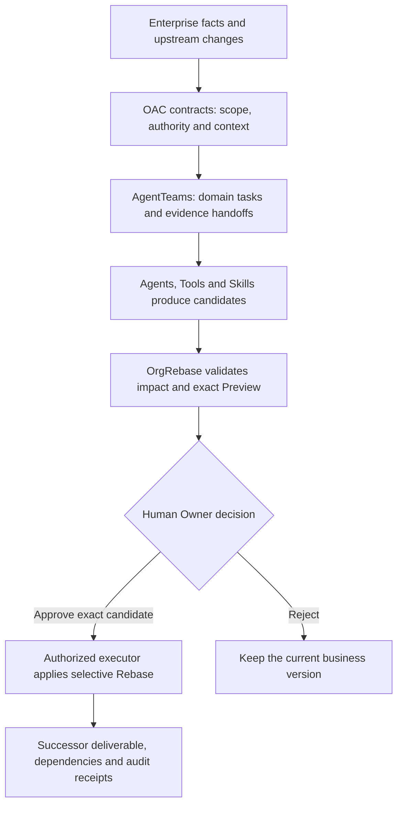

<p align="right"><strong>English</strong> · <a href="README.zh-CN.md">简体中文</a></p>

# OrgRebase

**An enterprise work evolution engine governed by OAC, the proposed Organizational Agent Contract.**

OrgRebase forms the smallest contract-valid Agent team for an employee task, keeps Agents, Tools and Skills on the candidate side of the authority boundary, and selectively updates only the business objects proven to be affected.

One clone contains both trees. OrgRebase is PolyForm Noncommercial 1.0.0; it is **not** OSI Open Source. OAC keeps Apache-2.0 and CC BY 4.0 on its own paths. The current public revision is `main`. Tag `v0.4.0` is the workspace snapshot of the same 0.4.0 product.

[](https://github.com/bingjiezhu/OrgRebase/actions/workflows/ci.yml)
[](https://bingjiezhu.github.io/OrgRebase/en/)
[](https://github.com/bingjiezhu/OrgRebase/releases)
[](LICENSES.md)

| Path | What it is | Version |
|---|---|---|
| [`orgrebase/`](orgrebase/README.md) | Control plane, WebUI, Skills, schemas, tests, quote replay | 0.4.0 |
| [`oac-spec/`](oac-spec/README.md) | Contract, schemas, compiler, verifier, TCK | 0.3.0a0 |



## Start here

| Goal | Entry point |
|---|---|
| Install and run without a model | [Quick Start](#first-run-verify-one-public-transaction) |
| Read the documentation site | [English](https://bingjiezhu.github.io/OrgRebase/en/) · [中文](https://bingjiezhu.github.io/OrgRebase/) |
| Understand the product in this repository | [Product README](orgrebase/README.md) · [中文](orgrebase/README.zh-CN.md) |
| Reuse Skills, Packs or the control plane | [Skills](orgrebase/docs/guide/skills.en.md) · [Reuse contract](orgrebase/docs/REUSE-AND-LICENSING.md) |
| Deploy with identity and PostgreSQL | [Deployment](orgrebase/docs/guide/deployment.en.md) |
| Contribute | [Contributing](orgrebase/CONTRIBUTING.md) · [Community](COMMUNITY.md) |

The documentation site is built from the same Markdown as `orgrebase/docs/guide/`. Core guides are paired Chinese/English pages. Deeper technical notes keep their original language and are labeled.

## First run: verify one public transaction

CPython 3.12–3.14 and [uv](https://docs.astral.sh/uv/). Network is required to install locked dependencies. The replay itself needs no cloud credentials, PostgreSQL or OAC.

```bash
git clone https://github.com/bingjiezhu/OrgRebase.git
cd OrgRebase/orgrebase
uv sync --locked --all-extras
uv run --frozen python scripts/run_public_quote_replay.py \
  --output ../quote-first-run --limit 1
```

The output directory must not already exist. Open `../quote-first-run/index.html`. Invoice `560602` should report `status=PASS` with before/after quotes for the same basket. In `report.json`, expect `status=PASS`, `planned_cases=1` and `outcomes.PASS=1`. Omit `--limit 1` and pick a new output directory to replay the pinned sample.

Contributor check from `orgrebase/`:

```bash
make check-core
```

This validates the pricing and governance loop, not native AgentTeams or a customer deployment. Next, try the [rule-Pack reuse exercise](orgrebase/docs/REUSE-AND-LICENSING.md#try-a-rule-pack-without-changing-the-engine) without modifying the engine.

## Reuse without rewriting the engine

| Keep | Adapt | Prove it |
|---|---|---|
| Source-version binding, impact, exact-owner approval, selective Apply, receipts | Organization facts, owners, source and target connectors | [Reuse and licensing](orgrebase/docs/REUSE-AND-LICENSING.md) |
| Skill discovery, evaluation and fail-closed release | Candidate programs and domain cases | [Skills guide](orgrebase/docs/guide/skills.en.md) |
| OAC schemas, compiler, verifier, TCK | Organization profile and admitted contract | [`oac-spec/`](oac-spec/README.md) |

AgentTeams v1.2.3 is an Apache-2.0 upstream, pinned as a Git bundle. Adapters in this repository do not relicense it, do not claim an upstream contribution, and do not make a live cluster `LIVE` by being present.

## Native reference journey

After this workspace clone, OAC is already at `../oac-spec`:

```bash
export ORGREBASE_VERTEX_PROJECT="YOUR_GCP_PROJECT"
export ORGREBASE_VERTEX_MODEL_ID="gemini-3.8-flash"
export ORGREBASE_OAC_ROOT="$(pwd)/../oac-spec"
./run-semifinal-demo.sh live
```

Keep credentials in the environment, not in the repository. A configured provider is not proof of a successful call. Details: [Vertex guide](orgrebase/docs/guide/models-vertex.en.md).

## What is published

| Area | Where to look |
|---|---|
| Core engine | `orgrebase/src/orgrebase/` |
| Agent identities and AgentTeams lock | `orgrebase/docs/AGENT-IDENTITIES.md`, `orgrebase/agentteams/` |
| Skills | `orgrebase/skills/`, `orgrebase/docs/guide/skills.en.md` |
| Schemas | `orgrebase/schemas/`, `oac-spec/schemas/` |
| HTTP / model / tool interfaces | `orgrebase/docs/MODEL-AGENT-TOOL-INTERFACES.md` |
| Tests and evaluation | `orgrebase/tests/`, `make check-core`; OAC TCK under `oac-spec/` |
| Documentation site | [bingjiezhu.github.io/OrgRebase](https://bingjiezhu.github.io/OrgRebase/en/) |
| Deploy | `orgrebase/docs/guide/deployment.en.md` |
| Dependencies | `orgrebase/uv.lock`, `oac-spec/uv.lock` |
| Changelog | `orgrebase/CHANGELOG.md` |

## Contributing and security

- Issues: bug, feature, and reuse/feedback templates
- [`COMMUNITY.md`](COMMUNITY.md) · [`orgrebase/CONTRIBUTING.md`](orgrebase/CONTRIBUTING.md)
- [`orgrebase/SECURITY.md`](orgrebase/SECURITY.md) (private advisory)
- Version tags on [Releases](https://github.com/bingjiezhu/OrgRebase/releases)

Core CI runs on every push. Full OAC + PostgreSQL validation is `workflow_dispatch` only. The documentation site deploys from the same Markdown on `main`.

This repository does not claim unaffiliated production deployments. Record a reuse attempt with the Reuse issue template.

## License

See [LICENSES.md](LICENSES.md). Commercial use of OrgRebase needs a separate written grant.
