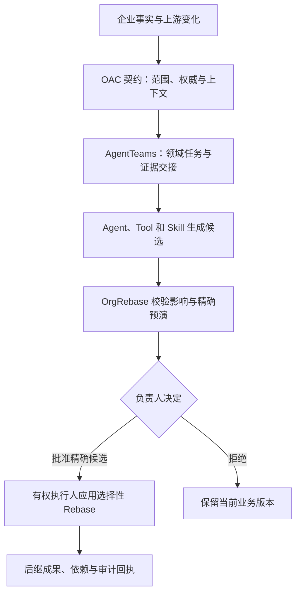

<p align="right"><a href="README.md">English</a> · <strong>简体中文</strong></p>

# OrgRebase

**基于 OAC（Organizational Agent Contract，组织级 Agent 契约标准草案）治理的企业工作持续演化引擎。**

OrgRebase 为员工任务形成最小且符合契约的 Agent 团队，让 Agent、Tool 和 Skill 始终位于候选一侧，并只更新被证明受影响的业务对象。

一次 clone 包含两棵树。OrgRebase 使用 PolyForm Noncommercial 1.0.0，**不是** OSI 开源。OAC 在自己的路径上保持 Apache-2.0 与 CC BY 4.0。当前公开修订是 `main`。标签 `v0.4.0` 是同一产品版本 0.4.0 的工作区快照。

[](https://github.com/bingjiezhu/OrgRebase/actions/workflows/ci.yml)
[](https://bingjiezhu.github.io/OrgRebase/)
[](https://github.com/bingjiezhu/OrgRebase/releases)
[](LICENSES.md)

| 路径 | 内容 | 版本 |
|---|---|---|
| [`orgrebase/`](orgrebase/README.zh-CN.md) | 控制面、WebUI、Skill、Schema、测试、报价复算 | 0.4.0 |
| [`oac-spec/`](oac-spec/README.md) | 契约、Schema、编译器、验证器、TCK | 0.3.0a0 |



## 从这里开始

| 目标 | 入口 |
|---|---|
| 无需模型，先安装并运行一单 | [快速开始](#第一次运行先核对一笔公开交易) |
| 阅读文档站 | [中文](https://bingjiezhu.github.io/OrgRebase/) · [English](https://bingjiezhu.github.io/OrgRebase/en/) |
| 阅读本仓库产品说明 | [中文 README](orgrebase/README.zh-CN.md) · [English](orgrebase/README.md) |
| 复用 Skill、Pack 或控制面 | [Skill](orgrebase/docs/guide/skills.zh.md) · [复用与许可](orgrebase/docs/REUSE-AND-LICENSING.md) |
| 认证部署 | [部署指南](orgrebase/docs/guide/deployment.zh.md) |
| 参与贡献 | [贡献指南](orgrebase/CONTRIBUTING.md) · [社区说明](COMMUNITY.md) |

文档站由同一份 `orgrebase/docs/guide/` Markdown 构建。核心指南中英逐页配对；深层技术资料保留原文并标明语言。

## 第一次运行：先核对一笔公开交易

需要 CPython 3.12–3.14 和 [uv](https://docs.astral.sh/uv/)。安装依赖需要网络；复算本身不需要云凭据、PostgreSQL 或 OAC。

```bash
git clone https://github.com/bingjiezhu/OrgRebase.git
cd OrgRebase/orgrebase
uv sync --locked --all-extras
uv run --frozen python scripts/run_public_quote_replay.py \
  --output ../quote-first-run --limit 1
```

输出目录必须事先不存在。打开 `../quote-first-run/index.html`。发票 `560602` 应为 `status=PASS`。`report.json` 中应为 `planned_cases=1`、`outcomes.PASS=1`。去掉 `--limit 1` 并换新目录可复算完整固定样本。

贡献检查：在 `orgrebase/` 执行 `make check-core`。

这只验证计价与治理闭环，不证明原生 AgentTeams 或客户部署。下一步可做[不改引擎的 Pack 复用练习](orgrebase/docs/REUSE-AND-LICENSING.md#try-a-rule-pack-without-changing-the-engine)。

## 不改引擎的复用

| 保留 | 适配 | 如何核对 |
|---|---|---|
| 来源版本绑定、影响分析、精确负责人批准、选择性 Apply、回执 | 企业事实、负责人、来源与目标连接器 | [复用与许可](orgrebase/docs/REUSE-AND-LICENSING.md) |
| Skill 发现、评测与失败关闭发布 | 候选程序与领域用例 | [Skill 指南](orgrebase/docs/guide/skills.zh.md) |
| OAC Schema、编译器、验证器、TCK | 组织 Profile 与准入契约 | [`oac-spec/`](oac-spec/README.md) |

AgentTeams v1.2.3 是 Apache-2.0 上游，以 Git bundle 锁定。仓库内适配器不改变其许可，不是对 AgentTeams 的上游贡献，也不把受控本地证据升级为分布式生产部署。

## 原生参考旅程

本工作区 clone 后，OAC 已在 `../oac-spec`：

```bash
export ORGREBASE_VERTEX_PROJECT="YOUR_GCP_PROJECT"
export ORGREBASE_VERTEX_MODEL_ID="gemini-3.8-flash"
export ORGREBASE_OAC_ROOT="$(pwd)/../oac-spec"
./run-semifinal-demo.sh live
```

凭据留在运行环境。配置成功不等于调用成功。详见 [Vertex 指南](orgrebase/docs/guide/models-vertex.zh.md)。

## 开放范围

核心代码、Agent 身份、Skill、Schema、接口、测试与评测入口见英文 [README](README.md#what-is-published)。文档站：[中文](https://bingjiezhu.github.io/OrgRebase/) · [English](https://bingjiezhu.github.io/OrgRebase/en/)。

## 贡献与安全

Issue（缺陷 / 功能 / 复用反馈）、[社区说明](COMMUNITY.md)、[贡献指南](orgrebase/CONTRIBUTING.md)、[安全报告](orgrebase/SECURITY.md)、[Releases](https://github.com/bingjiezhu/OrgRebase/releases)。

Core CI 在每次 push 运行。完整 OAC + PostgreSQL 仅 `workflow_dispatch`。文档站由 `main` 上同一份 Markdown 发布。

本仓库不宣称无关第三方的生产采用。复用尝试请用 Reuse Issue 模板登记。

许可索引：[LICENSES.md](LICENSES.md)。OrgRebase 商业使用需要单独书面授权。
