# Architecture: proposal, control, and evidence planes

OrgRebase treats an enterprise deliverable as a versioned build artifact. Formation records the organizational premises actually read during execution. A later premise change produces a bounded impact proof and rebuilds only the invalidated artifact fields and dependencies.

## Two executable loops

### Work formation

```mermaid
flowchart LR
    U["Employee task"] --> T["Template-bound interpretation"]
    T --> P["Minimum Domain coalition"]
    P --> A["Product / Legal / Finance / GTM candidates"]
    A --> G["Authority, scope, purpose, freshness gates"]
    G --> C["Least-sufficient context"]
    C --> R["Reference-monitored renderer"]
    R --> W["Quote + WorkTrace + dependency manifest"]
    W --> S["Atomic Workspace graph snapshot"]
```



The Employee Task Agent proposes requirements from an active `TaskTemplate`. `CoalitionPlanner` selects a subset from the fixed Product, Legal, Finance, and GTM Worker pool. Domain output is always `candidate_only`; admission and context compilation remain deterministic.

### Change recovery

```mermaid
flowchart LR
    D["Admitted semantic change"] --> X["Locked Workspace snapshot"]
    X --> I["Impact Preview + ImpactCertificates"]
    I --> V["Exact VMRC effect set"]
    V --> A["Candidate-only advisory DAG"]
    A --> H["Scoped human approval"]
    H --> E["Selective Apply transaction"]
    E --> N["Successor Quote, trace, manifest, graph"]
    N --> K["Skill candidate evaluation"]
```



`ImpactEngine` and VMRC determine the effect set before advisory Agents run. The advisory path explains locked facts and may expose evidence gaps; it cannot decide impact, alter VMRC, approve, or write canonical state. Apply revalidates every digest and permission before the transaction starts.

## Authority planes

| Plane | Components | May produce | Cannot do |
|---|---|---|---|
| Proposal | Employee Task Agent, Domain Agents, change-advisory Agents, AgentTeams transport | Typed requirements, Claims, explanations, coverage gaps, Skill candidates | Admit facts, decide impact, approve, publish Skill, or write canonical state |
| Deterministic control | Template matcher, planner, admission/context, reference monitor, graph bridge, Impact/VMRC, approval, Apply, Skill evaluator | Admission decisions, certificates, state transitions, release verdicts | Treat Agent opinion as authority or skip a failed/unknown gate |
| Evidence | Canonical JSON, receipts, event chains, Evidence Index, ProofPack | Recomputable hashes, bindings, run/state history, verification outcomes | Invent missing business facts or prove an undeclared real-world graph is complete |

SQLite `StateStore` is the only normative local writer. AgentTeams task and Matrix state are transport state. Every Agent/Skill candidate crosses a typed admission or ingestion boundary before it can influence a deterministic decision.

## AgentTeams collaboration surfaces

OrgRebase uses two AgentTeams asset sets for two distinct tasks.

### Workspace formation coalition

- `agentteams/workspace/team.yaml` defines the fixed Product, Legal, Finance, and GTM Worker pool.
- `TemplateBoundTaskInterpreter` is the Employee Task Agent; it is not a Worker in that Team.
- `CoalitionPlanner` enumerates all 15 non-empty Worker subsets and selects by coverage, card count, declared cost, and lexical order.
- `WorkspaceTransportCompiler` emits exact `DomainDelegationTask` bytes with run, nonce, deadline, actor projection, allowed slots, and output Schema.
- `structured-domain-handoff@1.0.0` carries candidate bundles with `target_writes=0`.
- The default demo uses `LocalDomainCandidateRegistry`/local deterministic transport. The external Workspace AgentTeams runtime and verifier are implemented, but live status remains `NOT_RUN` without correlated K8s, Matrix, artifact, Skill, and provider evidence.

### Change advisory

The Workspace change adapter compiles a bounded DAG:

```text
change-coordinator
    -> product-steward or finance-steward, selected by change domain
    -> gtm-steward
```

The repository also retains a Core five-Agent change-advisory Team with `change-coordinator`, Product, Legal, GTM, and `skill-curator`. Its frozen `LIVE_AGENTTEAMS` receipt proves that Core slice only; it does not upgrade the Workspace formation coalition.

The required AgentTeams capability mapping is stable across both surfaces:

| Capability | OrgRebase mapping |
|---|---|
| Role orchestration | Fixed Team/Worker assets plus source-locked identity and capability cards |
| Task decomposition | `CoalitionPlanner`, `OrchestrationCompiler`, and exact delegation tasks |
| Context passing | Actor-specific projection, admitted Claims, input refs, and digest-bound handoffs |
| Collaborative execution | Local deterministic transport or verified AgentTeams transport using the same schemas |
| State tracking | Run/nonce/task/receipt correlation; canonical Workspace versions remain in `StateStore` |

## Core objects and invariants

| Object | Contract |
|---|---|
| `ClaimVersion` / `PolicyVersion` | Versioned authority premise with source, validity, purpose, and sensitivity |
| `TaskTemplateVersion` | Declared slots, authority Domains, context policy, output lineage, and allowed tools |
| `CoalitionPlan` | Minimum capability-card subset covering the admitted slot set |
| `TaskContextManifest` | Least-sufficient, actor-specific admitted references with explicit exclusions |
| `WorkTrace` | Digest-chained values actually resolved plus output lineage |
| `RuntimeDependencyManifest` | Exact relationship between resolved slots, output fields, target version, and trusted graph edges |
| `WorkspaceGraphSnapshot` | Immutable object/edge/manifest universe promoted through a versioned graph pointer |
| `ImpactPreview` / `ImpactCertificate` | Affected, bounded-unaffected, Skill-requalification, or `UNKNOWN` result with witnesses |
| `MinimalRebaseCertificate` | Exact effect set: `REBUILD`, `PRESERVE_WITHIN_BOUNDARY`, `HOLD_FOR_REVIEW`, or `REQUALIFY` |
| `AgentCandidateIngestionReceipt` | Candidate bytes, input/run bindings, decision, and zero-write proof |
| `QualificationReport` | Exact Skill candidate, partitions, thresholds, failures, and release state |
| `RebaseReceipt` | Applied transitions, preserved targets, graph promotion, idempotency, and evidence bindings |

All digest-bearing objects use canonical JSON and SHA-256. Missing or stale binding data fails closed; insufficient dependency coverage becomes `UNKNOWN`, never `UNAFFECTED`.

## Execution-born dependencies

The renderer receives `ExecutionReferenceMonitor`, not a fixture dictionary, SQLite connection, or full task context. It can only call `resolve(slot_id)` and `finish(...)`. Each resolution records the admitted reference and value digest; `finish` binds output fields to resolved slots or declared task literals.

`TraceCoverageVerifier` requires complete output lineage and exact slot coverage. `RuntimeDependencyCompiler` then checks a bijection between the manifest's required slots and trusted inbound graph edges. A Boolean `coverage_complete` flag alone cannot authorize a bounded-unaffected conclusion.

## Certified selective rebase

For every admitted change:

1. lock the current object versions, graph pointer, policies, runtime, and Skill revisions;
2. compute semantic delta and impact over the immutable snapshot;
3. issue one `ImpactCertificate` per evaluated target;
4. compile VMRC from the exact Preview target set;
5. run candidate-only advisory and ingest its bound bytes;
6. bind approval to ChangeSet, Preview, VMRC, authorization root, scope, and expiry;
7. recheck all bindings, current versions, candidate ingestion, and payload rules before `BEGIN IMMEDIATE`;
8. execute dispositions generically rather than by object ID;
9. commit the successor Work, trace, manifest, graph pointer, receipts, event, and idempotency record atomically.

VMRC enforces both sufficiency and minimality: omitting a required rebuild fails, adding an unrelated rebuild also fails, and `UNKNOWN` cannot be preserved. A payload oracle confirms each rebuilt Quote field equals the admitted proposed value while preservation targets remain byte-for-byte unchanged.

The demo performs launch-date rebase, restarts the process, then performs currency rebase. Quote v3 and graph v3 are recovered from persisted pointers and artifacts.

## Candidate ingestion and tools

Agent candidate ingestion recomputes plan, task, input, run, evidence-class, and byte digests. `candidate_only=false`, `target_writes!=0`, undeclared outputs, added tasks, or admitted effects are rejected before Apply.

The Agent-facing `orgrebase.read_dependency_evidence` tool is read-only and graph-revision-bound. It has an HTTP/JSON `ToolContract`, actor authentication seam, strict input/output schemas, idempotency, errors, degradation, audit receipt, and MCP migration note. Failure can lower certainty to `UNKNOWN`; it cannot authorize an unaffected result. Canonical Git writes use a separate control-plane-only contract that rejects Agent identities.

## Proof and verification

`CompilationReceipt`, `CoordinationReceipt`, ingestion receipt, certificates, and rebase receipt provide runtime bindings. `evidence/latest/proof-pack.json` adds an independent closed-world structural check whose verifier imports the digest module but not `ImpactEngine`, workflow, store, service, or certificate implementations.

The ProofPack verifier checks:

- every embedded object digest;
- Preview result, certificate, VMRC target, and disposition set equality;
- plan, compilation, coordination, and ingestion bindings;
- identity, task-intent, fixture, edge, and manifest source locks;
- candidate-only and zero-write rules;
- requirement-slot to trusted-inbound-edge correspondence for bounded-unaffected results.

The ProofPack does not independently prove path classification, real-enterprise graph completeness, identity-to-DAG synthesis, or live candidate authenticity. Those limits remain explicit in the pack and release facts.

## Governed Skill lifecycle

Skill Foundry separates authorship from release authority:

1. Curator derives an immutable declarative candidate from redacted trajectories.
2. Evaluator loads the exact stored bytes and verifies candidate/executed-program digests.
3. The candidate is compared with no-Skill and previous-Skill baselines across replay, held-out, negative-transfer, permission, injection, malformed, resource, and canary partitions.
4. Any safety failure vetoes aggregate gain.
5. The only outcomes are `CANARY` and `QUARANTINED`; the candidate cannot publish itself.

The Workspace candidate language permits only `REQUIRE_FIELDS`, `MAP_VALUE`, and `RETURN_FIELD`; it has no arbitrary Python execution, tool access, or side effects.

## Rollback and failure semantics

Workspace formation/rebase uses one SQLite transaction, so injected failure before commit leaves Quote, Claim, graph pointer, events, and idempotency unchanged. This transaction-level rollback is covered by fault-injection tests.

The Core change-recovery slice also implements auditable business compensation. Its rollback plan is derived from the prior `RebaseReceipt`: rebuilt Work receives a new `ROLLED_BACK_PENDING_REBASE` version, Canary Skill is quarantined, and authority Claims are not rewritten. External Git writes use a journaled commit/revert saga.

Core business-compensation receipts are not presented as Workspace successor-graph rollback. A Workspace-specific compensating rollback would also need to promote a new Quote, WorkTrace, dependency manifest, snapshot, and graph pointer atomically; that feature is not part of this release.

## Replaceable infrastructure

The local profile uses SQLite, frozen JSON configuration, typed in-process Domain ports, HTTP `ToolContract`, and file OTLP/evidence output. Production adapters may use PostgreSQL/PolarDB, Nacos, Higress, RocketMQ, MCP, and an OTLP collector, provided they preserve the same schemas, authority separation, version locks, idempotency, privacy filters, and evidence semantics. Exact choices and migration costs are listed in `THIRD-PARTY-INVENTORY.md`.
