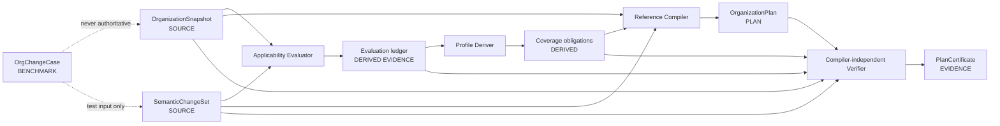

# Architecture: one contract loop, four authority classes

OAC deliberately has one narrow center. Everything either declares admitted source facts, proposes a
plan, verifies that proposal, or supplies non-authoritative research evidence.

See [Related work and contribution boundaries](related-work.md) for an informative comparison with
authorization, provenance, and agent-governance systems. It does not change the normative contracts.



The compiler is replaceable and untrusted. It may choose a topology; it cannot invent admitted roles,
qualifications, authority, dependencies, or evidence. The verifier sees only frozen wire artifacts and
public Profile rules. It checks the constraint set, not whether the plan resembles a preferred graph.
In v0.2 both tools share the executable Supplier Profile oracle in `src/oac/supplier.py`; therefore
the verifier is independent of compiler strategy and topology, but not an independent semantic
implementation of the Profile. Spec 003 owns that stronger gate.

The Snapshot root is an admitted input, not a self-authenticating document. Envelope digests protect
wire integrity, while identity proof, signature validation, and the decision to admit an owner,
governance policy, or external source remain upstream bindings. The MVP checks that Change, Plan, and
Certificate stay coherent with that root; it does not turn a declared `ownerRef` into authority by
cryptography or string matching.

## Module boundaries

| Layer | Owns | Must not own |
|---|---|---|
| `models` and `canonical` | strict wire types, detached digests | supplier policy or planning choices |
| `applicability` | pure, total Strong-Kleene evaluation over frozen inputs | graph traversal, authority grants, or planning choices |
| `profiles/supplier-change` | normative data, fixtures, and Profile provenance | executable strategy or enterprise writes |
| `src/oac/supplier.py` | non-normative executable Supplier Profile oracle | compiler topology or enterprise writes |
| `compiler` | one deterministic candidate-plan strategy | source admission or conformance truth |
| `verifier` | independent constraint evaluation and reason codes | compiler imports or hidden reasoning |
| `tck` | public fixtures, mutations, repeatability | benchmark claims or vendor-specific behavior |
| `benchmark` | exploratory labels, baselines, readiness | source authority or formal conformance |

Dependency flow is one-way:

```text
kernel ← profile ← compiler
   ↖ profile ← verifier

benchmark → public APIs only
tck       → CLI and public APIs only
```

If the verifier imports the compiler, a benchmark label becomes an admitted fact, or a plan mutates a
source resource, the architecture has failed even when every happy-path test passes.

## The four graph views

The MVP may serialize these views in compact resources, but their meanings remain separate:

1. Knowledge graph: evidence locators, facts, versions, and provenance.
2. Organization graph: domains, roles, principals, qualifications, and separation rules.
3. Dependency graph: admitted business relationships and bounded impact-transfer semantics.
4. Execution-intent graph: task RoleInstances, WorkUnits, coverage, and happens-before constraints.

Only the fourth graph is compiler output. Similarity, retrieval rank, or a generated message edge never
becomes organization authority merely because an Agent produced it.

A dependency edge is also not a universal broadcast channel. Its admitted predicate states which
semantic changes can traverse it. Contextual predicates are a closed conjunction over versioned
subject, scope, state/value, and relation atoms—not arbitrary policy code. `FALSE` blocks traversal;
`UNKNOWN` survives as an explicit duty or completeness boundary; each result cites the exact frozen
fields used. This keeps policy in the Source Contract and prevents a compiler from quietly inventing a
global list of “risky” supplier states.

## What this MVP can prove

It can prove deterministic serialization, frozen-root integrity, tri-valued contextual evaluation,
rule-bounded obligation derivation, compiler-independent plural plan validity under one shared Profile
oracle, structural mutation rejection, and honest data-readiness reporting. It cannot prove Profile semantic independence,
real-world completeness, business impact, human-label validity, runtime portability, or an open
standard consensus. Those require later gates, not a larger demo.
