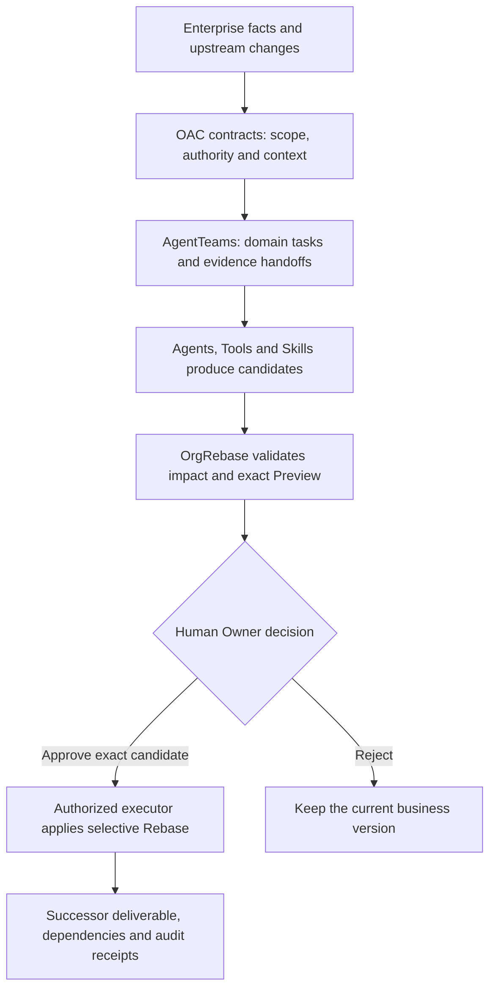

<p align="right"><strong>English</strong> · <a href="README.zh-CN.md">简体中文</a></p>

# OrgRebase

**An enterprise work evolution engine governed by OAC, the proposed Organizational Agent Contract.**

OrgRebase forms the smallest contract-valid Agent team for an employee task, keeps Agents, Tools, and Skills on the
candidate side of the authority boundary, and selectively updates only the business objects proven to be affected.

[](https://github.com/bingjiezhu/OrgRebase/actions/workflows/ci.yml)
[](https://bingjiezhu.github.io/OrgRebase/en/)

The current native cloud Demo uses **Vertex Gemini 3.8 Flash** through the explicit
[`live` launch mode](#run-the-reference-journey). The Quick Start below verifies the
pricing and governance loop without a model.

## Start here

| Goal | Entry point |
|---|---|
| Install and run without a model | [Quick Start](#first-run-verify-one-public-transaction) |
| Read the documentation | [English guides](docs/guide/index.en.md) · [中文指南](docs/guide/index.zh.md) · [Docs site](https://bingjiezhu.github.io/OrgRebase/en/) |
| Understand the architecture | [System overview](#architecture-at-a-glance) · [Architecture guide](docs/guide/architecture.en.md) |
| Integrate through the API | [API, model and tool interfaces](docs/MODEL-AGENT-TOOL-INTERFACES.md#public-api-surface) |
| Reproduce the Demo | [Browser walkthrough](docs/guide/demo.en.md) · [Release artifacts](https://github.com/bingjiezhu/OrgRebase/releases) |
| Deploy and operate | [Deployment guide](docs/guide/deployment.en.md) |
| Reuse Skills and enterprise rules | [Skills and Packs](docs/guide/skills.en.md) |
| Develop and contribute | [Development checks](#development-and-feedback) · [Contributing](CONTRIBUTING.md) |

Release videos are separate attachments for their matching source version. Use a release's actual artifact list to find its recording; the walkthrough remains the reproducible entry point when no matching video is published.

## First run: verify one public transaction

Run these commands from the `orgrebase/` source directory containing
`scripts/run_public_quote_replay.py`. Use Python 3.12.13 and [uv](https://docs.astral.sh/uv/).
Installing dependencies needs network access; the replay itself needs no model,
cloud credentials, PostgreSQL or sibling OAC repository.

```bash
uv sync --locked --all-extras
uv run --frozen python scripts/run_public_quote_replay.py \
  --output ../quote-first-run --limit 1
```

The output directory must not already exist. Open `../quote-first-run/index.html`:
the first invoice in the pinned sample is 560602. Expect `PASS` and before/after
quotes for the same basket under a controlled discount change. In `report.json`,
expect `status=PASS`; inside `measurement_summary`, check `planned_cases=1`,
`outcomes.PASS=1`, `outcomes.FAILED=0` and `outcomes.INCOMPLETE=0`.
This is an explicit one-invoice smoke run. Omit `--limit 1` and choose a new output
directory to replay the complete pinned sample.

The runner executes quote formation, preview, scripted-owner approval, Apply and
independent amount verification, including unapproved, wrong-owner and rejection
checks. Basket data is historical public data; discount, tax and authority are
controlled inputs. This validates the pricing/governance loop, not native
AgentTeams or human usability. Continue with the [pricing demo](docs/PRICED-QUOTE-DEMO.md)
to operate the same workflow in the browser.

Use source and documentation from the same revision. [Public releases](https://github.com/bingjiezhu/OrgRebase/releases)
may lag a local candidate; use the corresponding verified source delivery for an
unpublished candidate. An older release does not contain later local changes.
Next, try the [rule-Pack reuse exercise](docs/REUSE-AND-LICENSING.md#try-a-rule-pack-without-changing-the-engine)
without modifying the engine.

## Architecture at a glance



OAC supplies contracts, AgentTeams records task execution, and the deterministic control plane validates and applies authorized business changes. Missing evidence can return the same change for a new execution round; previous context and receipts remain available. See [architecture and authority](docs/guide/architecture.en.md) and [evidence recovery](docs/guide/agentteams.en.md#evidence-recovery).

## One user, one reference journey

The current MVP has one primary user: the **Quote Operations Owner**. Enterprise Quote is the bounded validation slice,
not the product boundary. Product, Legal, Finance, and GTM each pair a **Domain Agent** that prepares candidate work
with a **Human Owner** who retains canonical authority.

Domain separation gives each participating Agent a bounded context and source-bound
outputs. Missing evidence can be returned to the responsible domain while approved
work remains available. The [Agent inventory](docs/AGENT-IDENTITIES.md) explains the
actual role and context boundaries. A single Agent with independent approval, or a
workflow with access controls, can also separate duties; the multi-Agent design must
justify its coordination cost through these domain boundaries and evidence handoffs.

```text
one-time enterprise onboarding
  -> facts / knowledge / authority / capability / dependencies
  -> OAC candidate mapping and deterministic validation
  -> exact Enterprise Contract Owner approval
  -> immutable activation binding

change-driven enterprise work
  -> preserve the existing Quote and dependency baseline
  -> admit an upstream semantic change and freeze one ChangeSet
  -> discover affected domains from actual reads and exact source versions
  -> project the smallest change team from durable receipts and reuse already-admitted domain capabilities
  -> prepare only affected-branch candidates; golden mode executes pinned AT tasks and independent contract review for this ChangeSet
  -> deterministic zero-write Preview + VMRC proves the proposed selective update
  -> notify only the exact affected Human Owner and persistently pause with canonical writes = 0
  -> an authorized executor applies the exact approval through selective Rebase
  -> successor Quote + field diff + receipts + rollback anchor
```

Plans can differ across tasks. An admitted plan is immutable; evidence recovery creates a new execution round and preserves earlier plans, inputs, candidates and receipts.
Subsequent changes reuse the same candidate plan and approval path. Golden mode requires a pinned AT checkout, lock file,
and evidence directory. Actual delegation, submission, and acceptance receipts bind the exact ChangeSet, preview, and run
and appear in the change workbench. Matrix and object-storage transport for this added chain are controlled-local;
independent review is deterministic contract verification, not an external Element session, distributed execution,
or model-based business judgment. Reference mode remains explicitly local and deterministic. Failed or unknown attempts
are not redispatched automatically. Before approval, the exact owner can return a proposal for evidence; an authorized proposer can supply admitted evidence and select a registered executor instance for a new round of the same ChangeSet. See [evidence recovery](docs/guide/agentteams.en.md#evidence-recovery) for scope and API fields. Unknown outcomes do not enable redispatch. If the business commit succeeded but its result record is missing, an executor can recover that record without another approval or business version.
Candidate work advances automatically; only canonical changes, `UNKNOWN`, conflicts or overreach, and governed Skill
promotion cross an explicit authority gate.

## Authority boundary

```text
AT completed
  != Candidate admitted
  != Reviewer accepted
  != Human approved
  != Canonical applied
```

- OAC defines portable organizational contracts; it is not a runtime or business database.
- AgentTeams owns task-execution facts; it does not own business admission or canonical state.
- Agents, Models, Tools, and Skills produce candidates and evidence; they cannot self-authorize or self-approve.
- The deterministic OrgRebase control plane binds scope, impact, approval, Apply, and recovery.
- The exact Human Owner approves high-risk business changes.
- StateStore / RebaseWorkflow is the only canonical write path.

## Current evidence ceiling

The current defensible ceiling is **`VALIDATED_CONTROLLED_LOCAL`**. The enterprise deployment path uses PostgreSQL
with workspace isolation, verified OIDC identities and server-side browser sessions, and separate source and effect
workers. It has been exercised locally with real PostgreSQL and HTTPS, synthetic identities and business data,
and protocol fixtures for Dataverse. These observations do not establish qualification against a customer tenant.

[`evidence/release-facts.json`](evidence/release-facts.json) preserves the earlier SQLite/AgentTeams reference
journey and its exact material identities. It is not release evidence for later source changes.

The repository does **not** currently claim customer CRM/CPQ/CLM/ERP connector qualification, customer IAM and employee UAT, observed
enterprise ROI, distributed production AgentTeams, production multi-tenancy, SLA/SLO, capacity certification, or HA/DR.

For deployment, start with [authenticated PostgreSQL operation](docs/AUTHENTICATED-DEPLOYMENT.md), then configure
[source mapping and owner confirmation](docs/DATAVERSE-SOURCE-ONBOARDING.md),
[target qualification](docs/DATAVERSE-TARGET-OPERATIONS.md), and [operations and exit](docs/OPERATIONS-AND-EXIT.md).
Each workspace currently owns one Quote. Reuse is through a validated enterprise pack and explicit bindings;
arbitrary business object families require an admitted handler. The shipped Dataverse target adapter
can update only `name` and `description` on one configured Quote draft. It cannot change
prices, line items, customers, orders or quote status. Amount calculations and approved
Rebase results in OrgRebase do not imply those amounts were written to a CRM.
Local rollback restores a governed internal version; it does not undo an external write.

Choose the entry point for the work you want to do:

| Entry point | What it executes | What you must supply |
|---|---|---|
| Public transaction Quick Start | A fresh local pricing and governance workflow with deterministic candidates | Locked Python dependencies; no model or OAC required |
| Native reference journey below | Local AgentTeams taskflow, independent candidate review, exact approval and selective Rebase | The admitted OAC checkout and configured model provider; Matrix/object storage remain local fixtures |
| [Customer-bound deployment](docs/AUTHENTICATED-DEPLOYMENT.md) | Authenticated PostgreSQL runtime with explicit source and target bindings | A sealed v2 enterprise Pack, OIDC membership, database provisioning, connector credentials and customer-specific qualification |

The local OAC mapping and Skill qualification screens are not production onboarding endpoints.
Production deliberately rejects those fixture-backed flows. A v2 Pack and valid credentials
are prerequisites, not proof that an arbitrary customer's rules or connectors are supported.

For an offline demonstration of actual quote amounts, use the [public-data pricing journey](docs/PRICED-QUOTE-DEMO.md).
It replays retained UCI transaction baskets through Formation, Preview, owner approval, and Rebase, with independently
checked before/after amounts. Discount and tax rules are controlled assumptions. This path uses local deterministic
candidates; its results are separate from the native AgentTeams journey below.

## Run the reference journey

Run the native cloud reference with **`./run-semifinal-demo.sh live`**. This mode defaults to **Vertex Gemini 3.8 Flash**. It requires a matching OAC source tree, an authorized cloud project and credentials supplied outside the repository. Obtain the OAC revision identified by the source distribution or maintainer, place it at `../oac-spec`, or set `ORGREBASE_OAC_ROOT` to that checkout.

Previously: cloning the product tree alone did not include OAC, so the full journey needed a matching checkout next door.
Now: a workspace GitHub clone already has `orgrebase/` beside `oac-spec/`, so the default `../oac-spec` works. OAC remains the neighboring tree, not part of this Python package.
Why: they ship together while licenses and publication identity stay separate.

```bash
export ORGREBASE_VERTEX_PROJECT="YOUR_GCP_PROJECT"
export ORGREBASE_VERTEX_MODEL_ID="gemini-3.8-flash"
export ORGREBASE_OAC_ROOT="$(pwd)/../oac-spec"
./run-semifinal-demo.sh live
```

The [Vertex guide](docs/guide/models-vertex.en.md) explains credentials, model receipts and failure boundaries. Real cloud calls can incur charges; a configured provider is not evidence of a successful call.

**DeepSeek is an optional native Reviewer provider**, using the configured `deepseek-flash` API alias. Its launcher requires explicit `ORGREBASE_OAC_EXECUTION_MODE=LIVE_VERTEX`: Vertex performs OAC mapping and DeepSeek performs Reviewer work, so both Vertex project/credentials and `DEEPSEEK_API_KEY` are required. Follow the [DeepSeek guide](docs/guide/models-deepseek.en.md); `OFFLINE_LOCAL` rejects this cloud provider. Only mocked protocol/integration tests support this optional path so far; no live DeepSeek business run is claimed. It does not add DeepSeek to the separate change-round Responses V2 adapter. Four domain Workers remain deterministic. Model calls, native task execution, human approval and canonical Apply are distinct facts.

### Local fallback and retained verification

The existing `./run-semifinal-demo.sh interactive` path remains available as an explicitly selected local evaluation fallback. It requires a running Ollama service and `qwen2.5:3b` with exact digest `357c53fb659c5076de1d65ccb0b397446227b71a42be9d1603d46168015c9e4b`. Check the local model list and license before use; a matching model name alone is insufficient. The [Qwen Research License](https://huggingface.co/Qwen/Qwen2.5-3B-Instruct/blob/main/LICENSE) limits its grant to research/evaluation, with commercial use requiring upstream permission. Ollama's software license does not replace model terms. Model weights are not distributed with OrgRebase.

Frozen evidence can be inspected separately when the matching archive is present:

```bash
python3 scripts/verify_golden_pilot_evidence.py \
  --root evidence/golden-competition/latest/pilot
```

That standard-library verifier checks a historical run; it does not execute a new model or business workflow. Lightweight source distributions may omit the full historical archive.

## Development and feedback

`uv.lock` is the resolved dependency source; requirements files are generated exports.
Start with `make check-core`: it checks core contracts, authority, pricing and isolated
package resources without OAC, PostgreSQL or service credentials. This is a bounded
contributor check. Full `make check` additionally requires the admitted OAC checkout
and PostgreSQL tools; missing database tools fail rather than silently skipping the
database tests. For a focused change, run its tests and lint the changed modules:

```bash
uv run --frozen pytest -W error tests/test_architecture_boundaries.py
uv run --frozen ruff check src/orgrebase/commit_gateway.py
```

Replace the paths with the modules you changed. `make check` also verifies retained
evidence and OAC integration; PostgreSQL checks need the tools described in
[authenticated deployment](docs/AUTHENTICATED-DEPLOYMENT.md). Use the
[contribution rules](CONTRIBUTING.md) and [PR template](.github/pull_request_template.md)
to state the behavior change, protected invariant and actual verification.
[Issues](https://github.com/bingjiezhu/OrgRebase/issues) accept questions and proposals;
reuse and integration attempts use the Reuse template. The [community note](docs/COMMUNITY.md)
records the public reuse surface. Use the private [security reporting channel](SECURITY.md) for vulnerabilities.

The detailed [SYSTEM-MAP](docs/SYSTEM-MAP.md) is currently in Chinese. This English
README and [architecture overview](docs/ARCHITECTURE.md) provide English entry points.

## Adapt the reference to your organization

The [reuse and licensing guide](docs/REUSE-AND-LICENSING.md) separates reusable governance,
organization-specific rules, and target adapters, with source interfaces and acceptance boundaries.
Use the [architecture](docs/ARCHITECTURE.md) and [system diagram](docs/diagrams/orgrebase-system-architecture.html)
for implementation context. The guide also distinguishes the product's commercial grant from
the separate OAC and third-party licenses.

## Supported workflow

- one Enterprise Quote scenario with Product / Legal / Finance / GTM collaboration;
- visible Quote `v1 -> v2 -> v3` evolution;
- impact derived from actual reads and exact source versions;
- exact-owner approval;
- selective Rebase rather than full rebuild;
- fail-closed `UNKNOWN`, overreach, stale digest, and stale approval handling;
- versioned deliverables, traces, receipts, and recoverable history.

OAC, AgentTeams, Tools and Skills support this business workflow.

## Repository map

```text
src/orgrebase/                 product and deterministic control plane
examples/enterprise-quote-pilot/
                               bounded reference input
skills/                        governed Skill packages
schemas/                       contracts and projections
tests/                         behavior and non-regression checks
evidence/                      current machine evidence and required retained runs
docs/SYSTEM-MAP.md             product scope and interfaces
docs/README.md                 progressive context index
vendor/agentteams/             pinned offline-reconstructable AgentTeams source bundle
```

For contribution rules, see [CONTRIBUTING.md](CONTRIBUTING.md). Project-owned material uses the
same path licenses as OAC: [Apache License 2.0](LICENSE) for executable and machine-readable
assets, and [CC BY 4.0](LICENSES/CC-BY-4.0.txt) for normative prose. The path index is
[LICENSE.md](LICENSE.md). Tag `v0.4.0` remains the earlier PolyForm Noncommercial snapshot.
