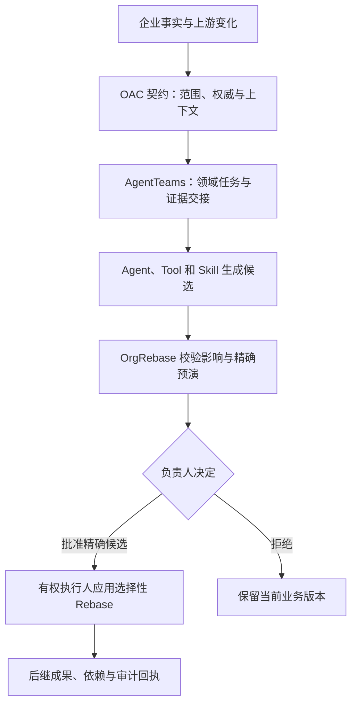

<p align="right"><a href="README.md">English</a> · <strong>简体中文</strong></p>

# OrgRebase

**基于 OAC（Organizational Agent Contract，组织级 Agent 契约标准草案）治理的企业工作持续演化引擎。**

OrgRebase 为员工任务形成最小且符合契约的 Agent 团队，让 Agent、Tool 和 Skill 始终位于
候选一侧，并只更新被证明受影响的业务对象。

[](https://github.com/bingjiezhu/OrgRebase/actions/workflows/ci.yml)
[](https://bingjiezhu.github.io/OrgRebase/)

当前原生云模型 Demo 明确使用 **Vertex Gemini 3.8 Flash**，通过
[`live` 启动模式](#运行参考主线)运行。下方快速开始无需模型，先验证计价与治理闭环。

## 从这里开始

| 目标 | 入口 |
|---|---|
| 无需模型，先安装并运行一单 | [快速开始](#第一次运行先核对一笔真实商品数据) |
| 阅读使用文档 | [中文指南](docs/guide/index.zh.md) · [English guides](docs/guide/index.en.md) · [文档站](https://bingjiezhu.github.io/OrgRebase/) |
| 理解架构 | [系统概览](#架构概览) · [架构指南](docs/guide/architecture.zh.md) |
| 通过 API 集成 | [API、模型与工具接口](docs/MODEL-AGENT-TOOL-INTERFACES.md#public-api-surface) |
| 复现 Demo | [浏览器操作指南](docs/guide/demo.zh.md) · [发行附件](https://github.com/bingjiezhu/OrgRebase/releases) |
| 部署与运维 | [部署指南](docs/guide/deployment.zh.md) |
| 复用 Skill 和企业规则 | [Skill 与企业 Pack](docs/guide/skills.zh.md) |
| 继续开发和贡献 | [开发检查](#开发与反馈) · [贡献指南](CONTRIBUTING.md) |

Demo 视频作为对应源码版本的发行附件单独提供，以该发行实际列出的文件为准。尚无匹配视频时，按操作指南复现，不把旧版本录像作为当前版本结果。

## 第一次运行：先核对一笔真实商品数据

以下命令针对包含 `scripts/run_public_quote_replay.py` 的本版源码，在 `orgrebase/` 目录执行。
使用 Python 3.12.13 和 [uv](https://docs.astral.sh/uv/)。首次安装依赖需要联网；回放本身不需要
模型、云凭据、PostgreSQL 或相邻 OAC 仓库。

```bash
uv sync --locked --all-extras
uv run --frozen python scripts/run_public_quote_replay.py \
  --output ../quote-first-run --limit 1
```

输出目录必须尚不存在。打开 `../quote-first-run/index.html`：默认固定样本的首单为 560602，
应看到 `PASS`，以及同一批商品在受控折扣变化前后的报价。`report.json` 应记录
`status=PASS`；`measurement_summary` 内应为 `planned_cases=1`、`outcomes.PASS=1`、
`outcomes.FAILED=0` 和 `outcomes.INCOMPLETE=0`。这只是明确选取的一单检查。
去掉 `--limit 1`、换一个新目录可运行完整固定样本。

这条路径实际执行报价、预演、脚本身份批准、应用和独立金额核对，并检查未批准、错误负责人和拒绝情形。
商品明细来自公开历史交易，折扣、税率与组织权限为受控配置。它验证计价与治理闭环，
不证明原生 AgentTeams 或人工使用效果。要自己在页面中操作，接着运行
[报价演示的准备和启动命令](docs/PRICED-QUOTE-DEMO.md#复现准备)。

源码与文档须来自同一版本。[公开发行](https://github.com/bingjiezhu/OrgRebase/releases)可能落后于
本地候选版本；未发布候选使用对应的可验证源码交付包，不把旧 release 当作当前源码。
需要修改企业规则时，先做[不改引擎的 Pack 复用练习](docs/REUSE-AND-LICENSING.md#try-a-rule-pack-without-changing-the-engine)。

## 架构概览



OAC 提供组织契约，AgentTeams 记录任务执行，确定性控制面验证并应用获授权的业务变化。缺少依据时，同一变更可以进入新的补证执行轮次，原上下文和回执继续保留。详见[架构与权威](docs/guide/architecture.zh.md)和[协作与补证恢复](docs/guide/agentteams.zh.md)。

## 一个用户，一条参考主线

当前 MVP 只有一个主用户：**企业报价变更负责人**。Enterprise Quote 是当前验证切片，不是产品边界。
Product、Legal、Finance 和 GTM 每个领域由 Domain Agent 自动完成候选工作，由 Human Owner 持有
本领域规范权威；它们不是四个并行产品。

领域分工让每个参与的 Agent 使用受限上下文，并交付绑定来源的候选。缺失证据可以退回
对应领域补齐，已准入的工作继续保留。[Agent 清单](docs/AGENT-IDENTITIES.md)说明实际角色和
上下文边界。单 Agent 配合独立审批、具有权限控制的工作流，同样能够实现职责分离；
多 Agent 的协作成本需要由领域隔离和证据交接带来的收益支撑。

```text
一次性企业接入
  → 事实 / 知识 / 权限 / 能力 / 依赖
  → OAC 候选映射与确定性校验
  → Enterprise Contract Owner 批准精确版本
  → 不可变激活绑定

变化驱动的持续工作
  → 既有 Quote 与依赖基线
  → 上游语义变化到达并冻结 ChangeSet
  → 根据持久收据投影最小变化团队，复用已准入领域能力与最小上下文
  → 只为受影响分支准备候选；golden 模式为本次 ChangeSet 执行固定版本 AT 任务与独立契约复核
  → 确定性控制面锁定零写入 Preview + VMRC
  → 只通知需要规范写入的精确 Human Owner
  → 流程持久化暂停；批准前目标写入为 0
  → 有执行权限的主体依据精确批准执行选择性 Rebase
  → Quote 后继版本 + 字段差异 + 回执 + 回滚点
```

计划可在不同任务之间变化。已准入计划不就地改写；补证恢复另建执行轮次，并保留旧计划、输入、候选与回执。

后续变更复用同一个候选计划和批准入口。`golden` 模式要求配置固定 AT checkout、锁文件和证据目录；
实际委派、提交和验收记录绑定本次 ChangeSet、预演和运行身份，在变化工作台中显示。
当前新增链路的 Matrix 与对象存储传输是受控本地实现，独立复核是确定性契约校验；
它不等于外部 Element 会话、分布式执行或模型业务判断。普通参考模式仍明确标记为本地确定性候选。
任务失败或结果未知不会自动重派。批准前，精确负责人可退回补证；有提案权限的用户补交已准入证据并选择注册执行实例，为同一ChangeSet开启新轮次。具体范围与API字段见[补证恢复](docs/guide/agentteams.zh.md#evidence-recovery)。未知结果不开放重派。业务已经提交而结果记录缺失时，执行者可恢复原记录，无需再次批准或生成版本。
候选层默认自动推进；只有规范写入、证据不足、越权/冲突或 Skill 发布等精确权威点进入人工等待。

## 权威边界

```text
AT completed
  != Candidate admitted
  != Reviewer accepted
  != Human approved
  != Canonical applied
```

- OAC 定义可移植的组织契约；它不是 Runtime 或业务数据库。
- AgentTeams 拥有任务执行事实；它不拥有业务准入或规范状态。
- Agent、Model、Tool 和 Skill 产生候选与证据；它们不能自我授权或自我批准。
- OrgRebase 确定性控制面绑定范围、影响、审批、Apply 和恢复。
- 精确 Human Owner 批准高风险业务变更。
- StateStore / RebaseWorkflow 是唯一规范写入路径。

## 当前证据上限

当前可辩护上限仍是 **`VALIDATED_CONTROLLED_LOCAL`**。企业部署路径使用 PostgreSQL 工作区隔离、
验证过的 OIDC 身份、服务端浏览器会话，以及独立的来源和效果 worker；已在本地真实 PostgreSQL、
HTTPS、合成身份与业务数据、Dataverse 协议夹具上验证。真实客户租户仍须另行资格检查。

[`evidence/release-facts.json`](evidence/release-facts.json) 保留早期 SQLite/AgentTeams 参考主线及其精确材料身份，
不能用来证明之后的源码和制品。

本仓库当前**不声明**客户 CRM/CPQ/CLM/ERP 连接器资格、客户 IAM 与员工 UAT、实测企业 ROI、
分布式生产 AgentTeams、生产多租户、SLA/SLO、容量认证或 HA/DR 已完成。

部署从[认证与 PostgreSQL 配置](docs/AUTHENTICATED-DEPLOYMENT.md)开始，随后完成
[来源映射与负责人确认](docs/DATAVERSE-SOURCE-ONBOARDING.md)、[目标资格](docs/DATAVERSE-TARGET-OPERATIONS.md)
及[运维与退出](docs/OPERATIONS-AND-EXIT.md)。当前每个工作区持有一个 Quote；通过已验证的企业包与显式绑定复用，
新成果类型必须有已准入的 handler。现有 Dataverse 目标适配器只修改一个已配置报价草稿的
`name`、`description`，不修改价格、行项目、客户、订单或报价状态。OrgRebase 中的金额计算
和已批准 Rebase 不代表这些金额已经写回 CRM；内部回滚也不等于撤销外部写入。

按目的选择入口：

| 入口 | 实际执行 | 需要准备 |
|---|---|---|
| 公开交易快速开始 | 本地计价与治理闭环，候选由确定性程序产生 | 锁定的 Python 依赖；无需模型或 OAC |
| 下方原生参考旅程 | 本地 AgentTeams 任务链、独立候选复核、精确批准和选择性 Rebase | 准入的 OAC 源码与已配置的云模型提供方；Matrix/对象存储仍是本地夹具 |
| [绑定客户环境部署](docs/AUTHENTICATED-DEPLOYMENT.md) | 认证 PostgreSQL runtime、显式来源和目标绑定 | 密封的 v2 企业包、OIDC 成员映射、数据库预置、连接器凭据与客户场景资格核验 |

本地 OAC 映射与 Skill 资格页面不是生产接入入口；生产明确拒绝这些依赖夹具的路径。
v2 企业包和有效凭据只是前置条件，不代表已经适配任意企业规则与连接器。

需要展示真实金额时，使用[公开数据计价演示](docs/PRICED-QUOTE-DEMO.md)：内置的 UCI 历史交易商品明细
经过报价生成、预演、负责人批准和 Rebase，变更前后金额由独立算法核对。折扣、税率是明确标注的受控假设。
该入口不需要在线模型，使用本地确定性候选；其结果与下方原生 AgentTeams 主线分别核验。

## 运行参考主线

使用 **`./run-semifinal-demo.sh live`** 明确启动原生云模型主线；该模式默认模型为 **Vertex Gemini 3.8 Flash**。需要匹配的OAC源码、有权使用的云项目及仓库外凭据。取得源码分发说明或维护者指定的OAC版本后，将其放在`../oac-spec`，或设置`ORGREBASE_OAC_ROOT`指向该版本。

原先：单独 clone 产品仓库不包含 OAC，完整旅程要另取匹配版本放到旁边。现状：若 GitHub 按工作区发布，仓库根并列 `orgrebase/` 与 `oac-spec/`，一次 clone 后默认的 `../oac-spec` 即可用；OAC 仍是旁边的树，不是本 Python 包的一部分。为什么：两者配套交付，但许可和发布身份仍然分开。

```bash
export ORGREBASE_VERTEX_PROJECT="YOUR_GCP_PROJECT"
export ORGREBASE_VERTEX_MODEL_ID="gemini-3.8-flash"
export ORGREBASE_OAC_ROOT="$(pwd)/../oac-spec"
./run-semifinal-demo.sh live
```

凭据、模型回执和失败范围见[Vertex指南](docs/guide/models-vertex.zh.md)。真实云调用可能计费，配置成功不等于调用成功。

**DeepSeek是可选原生Reviewer提供方**，使用配置中的`deepseek-flash` API alias。启动器要求显式设置`ORGREBASE_OAC_EXECUTION_MODE=LIVE_VERTEX`：Vertex负责OAC映射，DeepSeek负责Reviewer，因此需要Vertex项目与凭据以及`DEEPSEEK_API_KEY`两套配置。按[DeepSeek指南](docs/guide/models-deepseek.zh.md)启动；`OFFLINE_LOCAL`拒绝该云提供方。目前这条可选路径只有模拟协议/集成测试，不宣称已有DeepSeek真实业务运行。它未扩展变化轮的Responses V2适配器；四域Worker仍为确定性程序。模型调用、原生任务执行、人工批准与规范Apply是不同事实。

### 本地备用与历史核验

保留的`./run-semifinal-demo.sh interactive`是明确选择的本地评估备用路径，需要运行中的Ollama和精确摘要为`357c53fb659c5076de1d65ccb0b397446227b71a42be9d1603d46168015c9e4b`的`qwen2.5:3b`。使用前核对本地模型清单与许可，不能只检查名称。[Qwen Research License](https://huggingface.co/Qwen/Qwen2.5-3B-Instruct/blob/main/LICENSE)限定研究/评估非商业用途，商用需上游许可；Ollama软件许可不替代模型条款。OrgRebase不分发模型权重。

如果具备对应完整档案，可独立核对冻结证据：

```bash
python3 scripts/verify_golden_pilot_evidence.py \
  --root evidence/golden-competition/latest/pilot
```

该标准库核验器读取历史运行，不产生新模型或业务执行。轻量源码包可能不含完整历史档案。

## 开发与反馈

`uv.lock` 是依赖解析来源，requirements 文件由它导出。普通贡献者可先运行
`make check-core`：不需要 OAC、PostgreSQL 或服务凭据，检查核心契约、权限、计价及隔离包资源。
这是有明确范围的基础检查。完整 `make check` 还需要配套 OAC 与 PostgreSQL 工具；
缺少数据库工具会失败，不能用基础检查替代完整资格。局部修改先运行对应检查，例如：

```bash
uv run --frozen pytest -W error tests/test_architecture_boundaries.py
uv run --frozen ruff check src/orgrebase/commit_gateway.py
```

将路径替换为本次改动的模块。完整检查还验证保留证据和 OAC 集成；PostgreSQL 检查需要
[认证部署说明](docs/AUTHENTICATED-DEPLOYMENT.md)中的工具。按[贡献规则](CONTRIBUTING.md)和
[PR模板](.github/pull_request_template.md)说明行为变化、保护的不变量与实际验证。
一般问题和建议使用[Issues](https://github.com/bingjiezhu/OrgRebase/issues)，复用与集成尝试使用 Reuse 模板；公开复用面见[社区说明](docs/COMMUNITY.md)。漏洞使用
[私密安全报告渠道](SECURITY.md)。

[SYSTEM-MAP](docs/SYSTEM-MAP.md)目前以中文维护；英文入口为[英文README](README.md)和
[架构概览](docs/ARCHITECTURE.md)。

## 适配自己的企业

[复用与许可指南](docs/REUSE-AND-LICENSING.md)区分可复用的治理机制、企业规则和目标适配器，并提供源码接口和验收边界。
实现细节见[架构说明](docs/ARCHITECTURE.md)与[系统架构图](docs/diagrams/orgrebase-system-architecture.html)。
该指南也分别说明产品商业授权、独立 OAC 仓库和第三方依赖的许可条件。

## 业务主线

- 一个 Enterprise Quote 场景与 Product / Legal / Finance / GTM 协作；
- 可见的 Quote `v1 → v2 → v3` 演化；
- 依据实际读取和精确来源版本计算影响；
- 精确 Owner 审批；
- 选择性 Rebase，而非全量重做；
- `UNKNOWN`、越权、陈旧摘要和陈旧审批失败关闭；
- 版本化交付物、轨迹、回执和可恢复历史。

OAC、AgentTeams、Tool和Skill共同支持这条业务主线。

## 仓库地图

```text
src/orgrebase/                 产品与确定性控制面
examples/enterprise-quote-pilot/
                               有边界的参考输入
skills/                        受治理 Skill 包
schemas/                       契约与投影
tests/                         行为与非回归检查
evidence/                      当前机器证据与必需保留 run
docs/SYSTEM-MAP.md             产品范围与接口说明
docs/README.md                 渐进披露索引
vendor/agentteams/             可离线重建的锁定 AgentTeams 源 bundle
```

贡献规则见 [CONTRIBUTING.md](CONTRIBUTING.md)。非商业使用适用
[PolyForm Noncommercial 1.0.0](LICENSE)；商业使用需要[单独授权](COMMERCIAL-LICENSE.md)。
本仓库不宣称为 OSI Open Source。
