# Architecture: proposal, control, and evidence planes

OrgRebase treats an enterprise deliverable as a versioned build artifact. Formation records the organizational premises actually read during execution. A later premise change produces a bounded impact proof and rebuilds only the invalidated artifact fields and dependencies.

The product has one deterministic control plane. OAC is a proposed portable contract standard; the Spec 062 enterprise-adaptation layer is a pre-deployment admission surface around that control plane, not another runtime or source of business truth. The reader-facing overview and the two non-combinable evidence chains are in [SYSTEM-MAP.md](SYSTEM-MAP.md).

<!-- SPEC-062-VALIDATION-STATUS:START -->

> **Spec 062 implementation state:** `VALIDATED_CONTROLLED_LOCAL`. Evergreen reaches `READY_FOR_ORGREBASE`; Veracier retains seven gaps and stays `HOLD`; the 20-entry lane passes an independent verifier and six mutation checks. The existing Golden remains `oac_runtime_bridge=NOT_USED_IN_THIS_RUN`; real enterprise UAT and production readiness remain `NOT_RUN`.

<!-- SPEC-062-VALIDATION-STATUS:END -->

## Pre-deployment OAC adaptation boundary

| Stage | Authority | Durable artifact | State at this edit |
|---|---|---|---|
| Five-root semantic mapping | candidate-only mapper; deterministic or model-backed | mapping candidates with source digests and explicit Unknowns | `PASS_CONTROLLED_LOCAL` |
| OAC public validation | sibling `oac-spec` public CLI / installed equivalent | `OrganizationSnapshot`, `OrganizationalDemand`, validation receipt | `PASS`; five CLI checks plus dual-wheel boundary check |
| Source admission | `Enterprise Contract Owner` after a server-side four-second exact-digest gate | OAC `SourceAdmissionReceipt` | `PASS_CONTROLLED_LOCAL`; observed 5323ms |
| Formation compatibility | OrgRebase control plane; not the OAC compiler | `QuoteFormationParityReceipt` | `PASS`; five obligations / seven attempts |
| Runtime activation | OrgRebase admission with exact capsule/profile/pack match | `OACAdapterCapsule` and adaptation-to-execution binding | `PASS_CONTROLLED_LOCAL` |

The P0 parity receipt must say `oac_plan_produced=false`, `oac_plan_certificate_produced=false`, `oac_runtime_invoked=false`, and `formation_authority=ORGREBASE_CONTROL_PLANE`. The current OAC compiler is SupplierChange-specific; a Quote `OrganizationPlan` and `PlanCertificate` require a future Quote Profile, compiler-independent verifier, mutations, and TCK.

## Current agent collaboration contract (Specs 067–068)

The current MVP does not use a semantic super-agent as a hidden source of
business truth.  It uses a task-adaptive hub-and-spoke topology with one
deterministic coordinator role:

```text
admitted organizational demand and policy digests
    -> TaskFormationDecisionReceipt
    -> minimum capability-card coalition
    -> TaskAgentContextEnvelope
    -> sealed AgentTeamsExecutionPlan
    -> exact domain tasks + one Reviewer barrier
    -> structured candidates
    -> deterministic control plane / named human owner
```

The resident part of a Domain Agent is its identity, authority source types,
Capability Card, accepted input/output schemas, Tool/Skill allowlist,
freshness, disclosure, abstention and escalation rules.  Enterprise source
values do not become resident prompt text.  Each run receives only its
actor-specific projection, purpose, expiry and digest locks.  The Worker
revalidates the sealed task after AgentTeams ACK; the actual attempt-1 task set
is then recomputed from the same run and must equal the planned domain set.

Two retained proofs prevent the Quote example from masquerading as a universal
topology.  The OAC-bound Quote run plans and actually executes Finance, GTM,
Legal and Product.  A separate residency-FAQ task plans and actually executes
only Legal and Product plus one Reviewer barrier; Finance and GTM are absent.
Both stop at candidate state with zero canonical writes.

Renderer contexts record only the admitted projections actually supplied to that
stage. Sources never presented to the renderer are not claimed as evaluated
exclusions. Domain projections still record the actual cross-domain bindings they
withhold. An empty exclusion list means no exclusion decisions were recorded at
that stage; it is not a completeness or confidentiality certificate for all data.

Task-context compiler 2.1 removes the former fixed example exclusion entries in
Formation, Rebase and successor contexts. Stored committed receipts remain readable
under their original digests; their former example exclusions do not become proof
that those sources were inspected. Old prepared writes must be prepared again; runtime
revision checks likewise prevent an old Preview from inheriting new qualification.

## Two existing executable loops

### Work formation

```mermaid
flowchart LR
    U["Employee task"] --> T["Template-bound interpretation"]
    T --> P["Minimum Domain coalition"]
    P --> E["Sealed AgentTeams execution plan"]
    E --> A["Exact selected Domain candidates + Reviewer"]
    A --> G["Authority, scope, purpose, freshness gates"]
    G --> C["Least-sufficient context"]
    C --> R["Reference-monitored renderer"]
    R --> W["Quote + WorkTrace + dependency manifest"]
    W --> S["Atomic Workspace graph snapshot"]
```



The Employee Task Agent proposes requirements from an active `TaskTemplate`. `CoalitionPlanner` selects a subset from the registered Product, Legal, Finance, and GTM capability catalog. `AgentTeamsExecutionPlan` compiles only that subset into transport tasks and one independent Reviewer barrier. Domain output is always `candidate_only`; admission and context compilation remain deterministic.

### Change recovery

```mermaid
flowchart LR
    D["Admitted semantic change"] --> X["Locked Workspace snapshot"]
    X --> I["Impact Preview + ImpactCertificates"]
    I --> V["Exact VMRC effect set"]
    V --> A["Candidate-only advisory DAG"]
    A --> H["Scoped human approval"]
    H --> E["Selective Apply transaction"]
    E --> N["Successor Quote, trace, manifest, graph"]
    N --> K["Skill candidate evaluation"]
```



`ImpactEngine` and VMRC determine the effect set before advisory Agents run. The advisory path explains locked facts and may expose evidence gaps; it cannot decide impact, alter VMRC, approve, or write canonical state. Apply revalidates every digest and permission before the transaction starts.

## Authority planes

| Plane | Components | May produce | Cannot do |
|---|---|---|---|
| Proposal | Employee Task Agent, Domain Agents, change-advisory Agents, AgentTeams transport | Typed requirements, Claims, explanations, coverage gaps, Skill candidates | Admit facts, decide impact, approve, publish Skill, or write canonical state |
| Deterministic control | Template matcher, planner, admission/context, reference monitor, graph bridge, Impact/VMRC, approval, Apply, Skill evaluator | Admission decisions, certificates, state transitions, release verdicts | Treat Agent opinion as authority or skip a failed/unknown gate |
| Evidence | Canonical JSON, receipts, event chains, Evidence Index, ProofPack | Recomputable hashes, bindings, run/state history, verification outcomes | Invent missing business facts or prove an undeclared real-world graph is complete |

`StateStore` is the sole normative store, using SQLite in local demonstrations or PostgreSQL in the authenticated enterprise path. AgentTeams task and Matrix state are transport state. Every Agent/Skill candidate crosses a typed admission or ingestion boundary before it can influence a deterministic decision.

## AgentTeams collaboration surfaces

OrgRebase uses two AgentTeams asset sets for two distinct tasks.

The product and operations surfaces are also deliberately separate. Employees use
the OrgRebase Workspace UI for change, impact, approval, and delivery. AgentTeams
Element or another dashboard is a back-office task-operations surface; it may consume
`GET /api/workspace/agentteams-operations`, but it receives no approval or canonical
write authority. That projection distinguishes native Formation, native per-ChangeSet
taskflow when enabled, and `LOCAL_DETERMINISTIC` advisories. Each uses its own recorded
identity; a Skill version reference or an in-process role projection cannot be
displayed as an observed AgentTeams invocation.

### Workspace formation coalition

- `agentteams/workspace/team.yaml` defines the registered Product, Legal, Finance, and GTM candidate pool; it does not force every run to create all four tasks.
- `TemplateBoundTaskInterpreter` is the Employee Task Agent; it is not a Worker in that Team.
- `CoalitionPlanner` enumerates all 15 non-empty Worker subsets and selects by coverage, card count, declared cost, and lexical order.
- `WorkspaceTransportCompiler` emits exact `DomainDelegationTask` bytes with run, nonce, deadline, actor projection, allowed slots, and output Schema.
- `AgentTeamsExecutionPlan` binds Formation, Context, Capability Card, actor projection and Schema digests, and is the only allowed source for the actual domain-task set.
- `structured-domain-handoff@1.1.2` carries candidate bundles with `target_writes=0`.
- The default demo uses `LocalDomainCandidateRegistry`/local deterministic transport. The external Workspace AgentTeams runtime and verifier are implemented, but live status remains `NOT_RUN` without correlated K8s, Matrix, artifact, Skill, and provider evidence.
- Retained controlled-local evidence proves both a four-domain Quote plan and a two-domain Legal/Product plan materialize exactly in pinned TeamHarness. This is not distributed production execution.

### Semifinal controlled-local native task slice

Spec 045 separately exercises the source-locked AgentTeams v1.2.2
`projectflow/taskflow` actions through the pinned upstream `call_tool` entry point.
It creates, plans, delegates, acknowledges, submits, inspects, accepts,
cancels/reassigns, fences a late attempt, and reaches a terminal project state.
The four accepted Product / Legal / Finance / GTM task roots are frozen into a
same-run `CoalitionResultBinding`; the selected GTM task supplies the bounded
invocation identity and binds a read-only HTTP Tool result. Only after both the
Tool receipts and exact four-domain roots validate may
`enterprise-quote-compose@1.3.0` produce a candidate. Source, Taskflow, Tool,
Skill and OTLP share one root run and end at
`CANDIDATE_ACCEPTED / CANONICAL_WRITES=0`.

This is `VALIDATED_CONTROLLED_LOCAL`: the upstream task semantics are real, but
the invocation is in-process and does not prove an independent Worker consumed
the task over Matrix/K8s or called a live model/provider. AgentTeams owns task
execution facts only; OrgRebase deterministic checks own candidate admission,
and no canonical business writer participates in this slice.

### Change advisory

The Workspace change adapter compiles a bounded DAG:

```text
change-coordinator
    -> product-steward or finance-steward, selected by change domain
    -> gtm-steward
```

The repository also retains a Core five-Agent change-advisory Team with `change-coordinator`, Product, Legal, GTM, and `skill-curator`. Its frozen `LIVE_AGENTTEAMS` receipt proves that Core slice only; it does not upgrade the Workspace formation coalition.

The required AgentTeams capability mapping is stable across both surfaces:

| Capability | OrgRebase mapping |
|---|---|
| Role orchestration | Fixed Team/Worker assets plus source-locked identity and capability cards |
| Task decomposition | `CoalitionPlanner`, `OrchestrationCompiler`, and exact delegation tasks |
| Context passing | Actor-specific projection, admitted Claims, input refs, and digest-bound handoffs |
| Collaborative execution | Local deterministic transport or verified AgentTeams transport using the same schemas |
| State tracking | Run/nonce/task/receipt correlation; canonical Workspace versions remain in `StateStore` |

## Core objects and invariants

| Object | Contract |
|---|---|
| `ClaimVersion` / `PolicyVersion` | Versioned authority premise with source, validity, purpose, and sensitivity |
| `TaskTemplateVersion` | Declared slots, authority Domains, context policy, output lineage, and allowed tools |
| `CoalitionPlan` | Minimum capability-card subset covering the admitted slot set |
| `TaskContextManifest` | Least-sufficient, actor-specific admitted references with explicit exclusions |
| `WorkTrace` | Digest-chained values actually resolved plus output lineage |
| `RuntimeDependencyManifest` | Exact relationship between resolved slots, output fields, target version, and trusted graph edges |
| `WorkspaceGraphSnapshot` | Immutable object/edge/manifest universe promoted through a versioned graph pointer |
| `ImpactPreview` / `ImpactCertificate` | Affected, bounded-unaffected, Skill-requalification, or `UNKNOWN` result with witnesses |
| `MinimalRebaseCertificate` | Exact effect set: `REBUILD`, `PRESERVE_WITHIN_BOUNDARY`, `HOLD_FOR_REVIEW`, or `REQUALIFY` |
| `AgentCandidateIngestionReceipt` | Candidate bytes, input/run bindings, decision, and zero-write proof |
| `CandidateSemanticMapping` | Spec 062 candidate-only mapping from one admitted Pack root to OAC paths, including source digest, Unknowns, reason codes, and zero-write ceiling; controlled-local verified |
| `QuoteFormationParityReceipt` | Spec 062 OrgRebase-owned coverage/authority/order parity proof; explicitly not an OAC `PlanCertificate`; independently verified |
| `OACAdapterCapsule` | Spec 062 exact binding across Profile, Pack, OAC Source admission, mappings, approval, Formation parity, and execution run; controlled-local verified |
| `QualificationReport` | Exact Skill candidate, partitions, thresholds, failures, and release state |
| `RebaseReceipt` | Applied transitions, preserved targets, graph promotion, idempotency, and evidence bindings |

All digest-bearing objects use canonical JSON and SHA-256. Missing or stale binding data fails closed; insufficient dependency coverage becomes `UNKNOWN`, never `UNAFFECTED`.

## Execution-born dependencies

The renderer receives `ExecutionReferenceMonitor`, not a fixture dictionary, SQLite connection, or full task context. It can only call `resolve(slot_id)` and `finish(...)`. Each resolution records the admitted reference and value digest; `finish` binds output fields to resolved slots or declared task literals.

`TraceCoverageVerifier` requires complete output lineage and exact slot coverage. `RuntimeDependencyCompiler` then checks a bijection between the manifest's required slots and trusted inbound graph edges. A Boolean `coverage_complete` flag alone cannot authorize a bounded-unaffected conclusion.

## Certified selective rebase

For every admitted change:

1. lock the current object versions, graph pointer, policies, runtime, and Skill revisions;
2. compute semantic delta and impact over the immutable snapshot;
3. issue one `ImpactCertificate` per evaluated target;
4. compile VMRC from the exact Preview target set;
5. run candidate-only advisory and ingest its bound bytes;
6. bind approval to ChangeSet, Preview, VMRC, authorization root, scope, and expiry;
7. recheck all bindings, current versions, candidate ingestion, and payload rules before `BEGIN IMMEDIATE`;
8. execute dispositions generically rather than by object ID;
9. commit the successor Work, trace, manifest, graph pointer, receipts, event, and idempotency record atomically.

VMRC enforces both sufficiency and minimality: omitting a required rebuild fails, adding an unrelated rebuild also fails, and `UNKNOWN` cannot be preserved. A payload oracle confirms each rebuilt Quote field equals the admitted proposed value while preservation targets remain byte-for-byte unchanged.

The demo performs launch-date rebase, restarts the process, then performs currency rebase. Quote v3 and graph v3 are recovered from persisted pointers and artifacts.

## Candidate ingestion and tools

Agent candidate ingestion recomputes plan, task, input, run, evidence-class, and byte digests. `candidate_only=false`, `target_writes!=0`, undeclared outputs, added tasks, or admitted effects are rejected before Apply.

The Agent-facing `orgrebase.read_dependency_evidence` tool is read-only and graph-revision-bound. It has an HTTP/JSON `ToolContract`, actor authentication seam, strict input/output schemas, idempotency, errors, degradation, audit receipt, and MCP migration note. Failure can lower certainty to `UNKNOWN`; it cannot authorize an unaffected result. Canonical Git writes use a separate control-plane-only contract that rejects Agent identities.

## Proof and verification

`CompilationReceipt`, `CoordinationReceipt`, ingestion receipt, certificates, and rebase receipt provide runtime bindings. `evidence/latest/proof-pack.json` adds an independent closed-world structural check whose verifier imports the digest module but not `ImpactEngine`, workflow, store, service, or certificate implementations.

The ProofPack verifier checks:

- every embedded object digest;
- Preview result, certificate, VMRC target, and disposition set equality;
- plan, compilation, coordination, and ingestion bindings;
- identity, task-intent, fixture, edge, and manifest source locks;
- candidate-only and zero-write rules;
- requirement-slot to trusted-inbound-edge correspondence for bounded-unaffected results.

The ProofPack does not independently prove path classification, real-enterprise graph completeness, identity-to-DAG synthesis, or live candidate authenticity. Those limits remain explicit in the pack and release facts.

## Governed Skill scaffold

The current package registry contains `enterprise-launch-readiness@1.4.2`,
`enterprise-quote-compose@1.3.1`, and `structured-domain-handoff@1.1.2`.
Manifest v2 binds each `SKILL.md`, contract, program, and exact input/output
Draft 2020-12 JSON Schema bytes. Schema resolution is local-only and fails
closed on external or unresolved refs. The controlled-local runner builds or
reuses the canonical wheel, then performs discovery, loading, evaluation,
fresh dependency requalification and invocation from an isolated
`INSTALLED_WHEEL` path. The historical
`enterprise-launch-readiness@1.3` contract remains only as a legacy adapter
asset for older receipts; it is not the current package head.

Each package keeps one canonical `SKILL.md`, with bilingual Chinese/English
discovery terms in `description`, a Chinese-first operational body, and
progressively loaded `references/zh-CN.md` plus `references/en.md`. Chinese,
English, mixed-language prompts, and Chinese filenames are covered by the
package evaluation fixtures; no parallel `SKILL.zh.md` is allowed to drift from
the executable entry point.

The valid recovery path is
`REQUALIFICATION_REQUIRED → EVALUATED → SHADOW → CANARY`, using a fresh
evaluation receipt and restored exact dependency set. This lifecycle proof is
still process-local: serialized receipts do not re-authorize a package in a new
process. The current `enterprise-quote-compose@1.3.1` release has independently
restored and invoked its exact direct predecessor `1.3.0` under restricted
execution; exact-key replay, process-state rehydration, authority/lineage
rejection, idempotency-conflict rejection, and Tool-binding tamper rejection
all pass with `target_writes=0`. Persistent signed trust, production rollout
rollback, and cross-enterprise security/generalization qualification remain
`NOT_RUN`.

Skill Foundry currently validates governance plumbing, not trajectory induction:

1. Curator requires at least two task/trace references but does not read their content; it emits an immutable candidate from a fixed `_CANDIDATE_ACTIONS` table.
2. Evaluator loads the exact stored bytes and verifies candidate/executed-program digests.
3. The candidate is checked on 16 constructed cases across replay, held-out, negative-transfer, permission, injection, malformed, resource, and canary partitions; expected actions come from the same fixed mapping.
4. Any safety failure vetoes aggregate gain.
5. The only outcomes are `CANARY` and `QUARANTINED`; the candidate cannot publish itself.

The Workspace candidate language permits only `REQUIRE_FIELDS`, `MAP_VALUE`, and `RETURN_FIELD`; it has no arbitrary Python execution, tool access, or side effects. The 16/16 result proves exact-byte, restricted-interpreter, gate, and requalification wiring. It does not prove Skill induction, generalization, independent outcome gain, or production Canary behavior.

## Rollback and failure semantics

Workspace formation/rebase uses one SQLite transaction, so injected failure before commit leaves Quote, Claim, graph pointer, events, and idempotency unchanged. This transaction-level rollback is covered by fault-injection tests.

The Core change-recovery slice also implements auditable business compensation. Its rollback plan is derived from the prior `RebaseReceipt`: rebuilt Work receives a new `ROLLED_BACK_PENDING_REBASE` version, Canary Skill is quarantined, and authority Claims are not rewritten. External Git writes use a journaled commit/revert saga.

Core business-compensation receipts are not presented as Workspace successor-graph rollback. A Workspace-specific compensating rollback would also need to promote a new Quote, WorkTrace, dependency manifest, snapshot, and graph pointer atomically; that feature is not part of this release.

## Replaceable infrastructure

The local profile uses SQLite, frozen JSON configuration, typed in-process
Domain ports, HTTP `ToolContract`, and file evidence. Spec 045 additionally
validates loopback Source/Tool HTTP plus an OTLP/HTTP receiver backed by local
SQLite query, retention and alert projections. Those are controlled-local
protocol and operations proofs, not an external collector or production
observability deployment.

Production adapters may use PostgreSQL/PolarDB, Nacos, Higress, RocketMQ, MCP,
and an OTLP collector, provided they preserve the same schemas, authority
separation, version locks, idempotency, privacy filters, and evidence semantics.
Real enterprise connectors, production IAM/multi-tenancy, HA, geographic DR,
capacity qualification and contractual SLA remain `NOT_RUN`. Exact choices and
migration costs are listed in `THIRD-PARTY-INVENTORY.md`.
